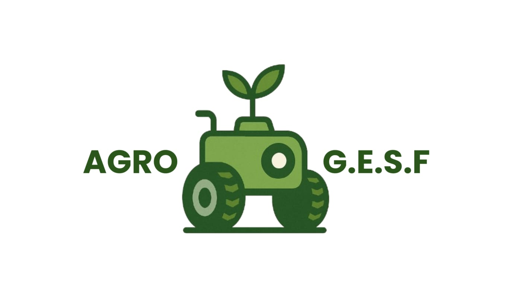

<div align="center">
  <h1>Agro-G.E.S.F</h1>
</div>
<br>

<p align="center">
  <a href="https://github.com/gustavoventieri/SecondVision">
    
  </a>
</p>

> O Agro-G.E.S.F é um sistema integrado de hardware e software desenvolvido para auxiliar pequenos produtores na detecção precoce de pragas e doenças por meio de redes neurais convolucionais (CNN).
## Tabela de Conteúdos

- [Introdução](#Introdução)
- [Documentação](#Documentação)
- [Instalação](#Instalação)
- [Desenvolvedores](#Desenvolvedores)

## Introdução

O atual trabalho propõe se ao desenvolvimento de um sistema embarcado para o
monitoramento de possíveis sinais de pragas em plantações no formato em linha. O
sistema contará com uma câmera, um carrinho de controle remoto para a locomoção e a bateria para manter o sistema ligado no campo.
Bem como, a utilização de uma SBC (Single Board
Computer) para o processamento local da imagem. O projeto busca viabilizar um meio acessível para pequenos
produtores, conseguirem monitorar suas lavouras de forma mais simplificada e
eficiente


## Documentação

* Monografia
* Diagrama de Casos de Uso
* Diagrama de Máquina-Estado
* Diagrama de Sequência
* Diagrama de Atividade
* Wireframes

## 💻 Pré-requisitos

Antes de começar a rodar o modelo, observe se seu sistema é capaz de suportá-lo

| Requisitos Mínimos | Requisitos Recomendados |
|------------------------------------|---------------------------------------|
| CPU: ARM Cortex-A76 2,4 GHz 4‑core  | CPU: Ryzen 7 5700G / i7-10700        |
| RAM: 8 GB LPDDR4                   | RAM: 16 GB DDR4+                     |
| GPU: VideoCore VII integrado       | GPU: RX 6750 XT / RTX 3060           |
| Armazenamento: 20 GB disponível          | Armazenamento: 50 GB disponível            |

## Instalação

Siga os passos abaixo para clonar o repositório e configurar o projeto:

> [!IMPORTANT]
> Certifique-se de estar em um ambiente compatível (Linux ou Windows) antes de prosseguir.

1. **Clone o repositório**
   ```bash
   git clone https://github.com/GustavoS07/Agro-G.E.S.F.git
   ```
2. **Acesse o Diretório do Projeto**
    ```bash
   cd Agro-G.E.S.F
   git checkout Aprendizado_Estruturado
   ```
> [!TIP]
> Considere usar um ambiente virtual para evitar conflitos de dependências.
  3. **Instale as dependências**
      ```bash
      pip install torch torchvision Pillow
      ```
  4. **Rodando o Teste**
     ```bash
     cd src/inference
     python3 teste.py
     ```

>[!WARNING]
>Caso encontre erros durante a execução, verifique as versões das dependências e se todas as configurações foram feitas corretamente.


## Desenvolvedores

<table width="100%">
  <tr>
    <td align="center" style="width: 25%;">
      <a href="https://github.com/GustavoS07" title="Perfil de Gustavo de Souza">
        <br>
        <sub><b>Gustavo de Souza</b></sub>
      </a>
    </td>
    <td align="center" style="width: 25%;">
      <a href="https://github.com/EnzoCostaPaz" title="Perfil de Enzo Costa">
        <br>
        <sub><b>Enzo Costa</b></sub>
      </a>
    </td>
    <td align="center" style="width: 25%;">
      <a href="https://github.com/osakirii" title="Perfil de Sakiri Moon">
        <br>
        <sub><b>Sakiri Moon</b></sub>
      </a>
    </td>
    <td align="center" style="width: 25%;">
      <a href="https://github.com/lipedeoliveira" title="Perfil de Felipe Vieira">
        <br>
        <sub><b>Felipe Vieira</b></sub>
      </a>
    </td>
  </tr>
</table>
